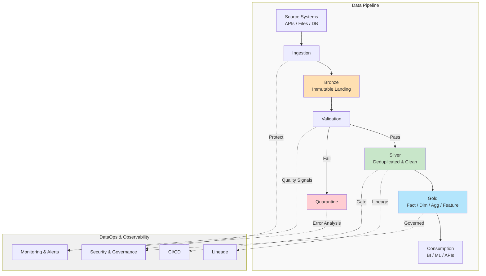

# Data Pipeline Architecture

## Overview

Production-oriented data pipeline using a **Bronze → Silver → Gold** layered architecture. Design priorities: simplicity, reliability, data quality, observability.

---

## Assumptions

| Dimension | Assumption |
|---|---|
| Processing | Daily batch cycles; sufficient for BI/analytics SLAs |
| Input format | CSV, JSON, or structured files |
| Scale | Millions of events/day |
| Storage | Cloud object storage (S3, GCS, or equivalent) |
| Consumers | BI tools, analytics queries, ML pipelines |
| Reliability | Accuracy and auditability prioritized over ultra-low latency |
| Team | Dedicated data engineering capability; self-service analytics is a future state |

---

## Architecture Diagram

Cloud-agnostic logical view — see *AWS Reference Implementation* for one concrete mapping.



---

## AWS Reference Implementation

One concrete mapping of the logical architecture onto AWS. Not a dependency — GCP (GCS/Dataproc/BigQuery) or Azure (ADLS/Databricks/Synapse) equivalents hold the same shape.

| Logical Component | AWS Service | Role |
|---|---|---|
| Bronze / Silver / Gold storage | S3 | Object storage for all three zones, partitioned by date |
| Ingestion & transformation compute | AWS Glue (Spark) | Runs ingestion, validation, and Silver/Gold transform jobs |
| Incremental file tracking | AWS Glue Job Bookmarks | Tracks processed files for append-only ingestion — incremental reruns without moving/deleting raw files |
| Table format / schema registry | Glue Data Catalog + Apache Iceberg | Schema versioning, time travel, safe concurrent writes |
| Consumption / query | Athena or Trino | Ad-hoc SQL and BI access without a provisioned warehouse |
| Observability | CloudWatch | Job logs, metrics, alarms for freshness/volume/error-rate |
| Access control | IAM | Least-privilege roles per zone |
| Secrets | Secrets Manager | Source-system credentials, never in code or plaintext CI vars |
| CI/CD | GitLab CI/CD | Lint/test/data-quality gates and environment promotion |

---

## Ingestion Strategy

Ingestion is pluggable; the downstream contract is not. Every mode lands data in Bronze in the same shape, so Validation → Silver → Gold never changes when the ingestion mechanism does.

| Mode | When | Bronze landing |
|---|---|---|
| **Batch** (implemented here) | Daily/hourly extracts, low-freshness SLAs | Full file read, written as-is with `ingestion_timestamp` |
| **Incremental (watermark/CDC)** | Source has `updated_at` or a CDC log | Pull rows past the last watermark, or apply CDC events append-only |
| **Streaming** (future) | Sub-minute freshness required | Kafka/Kinesis consumer micro-batches into the same Bronze layout |

Swapping ingestion modes means writing a new adapter, not redesigning the pipeline.

---

## Layer Design Decisions

### Bronze Layer (Raw Landing)

**Purpose:** Immutable, authoritative source for replay and audit.

Immutability is **logical, not physical**: business content is preserved exactly as received; only the on-disk encoding is optimized.

- No business validation, cleansing, enrichment, or deduplication — every source record is retained as-is.
- Format conversion is allowed: CSV/JSON → Parquet at landing time is an encoding change, not a business transformation — no field is altered, dropped, or reinterpreted.
- Append-only; never updated or deleted.
- Tagged with `ingestion_timestamp`, `source_system`, `ingestion_id`.

**Storage:** Parquet, partitioned by `ingestion_date` — columnar/compressed for efficient downstream query engines; the format changes, the record doesn't.

**Why:** Untouched business content keeps Bronze fully replayable — any downstream bug can be fixed and rerun against the same source-of-truth records. Validation, cleansing, and enrichment happen only after Bronze.

---

### Silver Layer (Cleaned & Deduplicated)

**Purpose:** Business-ready, single source of truth for analytics.

**Deduplication:**
- Key: `{customer_id, source_system, event_id}`
- Keep latest `event_timestamp`; tie-break on latest `ingestion_timestamp`
- 72h window covers late-arriving duplicates

**Standardization:**
- Timestamps → UTC ISO 8601; strict type coercion; consistent null handling
- PII masking and currency normalization are extension points — see *Extension Points*

**Storage:** Parquet, partitioned by `event_date` (not `ingestion_date`) — analytics queries prune by when the event happened, this stays consistent with Gold fact tables, and late-arriving records land in their correct historical partition (see *Late-Arriving Data & Reprocessing*). Sorted on `source_system`/`customer_id` for further pruning.

**Why:** Canonical form — one deterministic dedup rule, one schema, safe to build every downstream dataset from.

---

### Gold Layer (Curated Analytics)

**Purpose:** Business-oriented data products, not one generic "clean" table.

| Dataset type | Example | Primary consumer |
|---|---|---|
| Fact | `fact_events` (denormalized, partitioned by `event_date`) | SQL analysts, data products |
| Dimension | `dim_customers` (Type 2 SCD) | SQL analysts, "as-of" joins |
| Aggregate | `agg_daily_revenue` | BI dashboards |
| ML feature | Point-in-time feature tables built from Silver | ML training/serving (versioned) |

APIs consume aggregate/feature datasets through a thin read layer, never direct table access.

**Why:** Distinct dataset shapes per access pattern let each evolve independently while keeping its own contract stable.

---

## Schema Evolution

- **Additive changes are free:** new source fields land in Bronze (schema-on-read) and are ignored downstream until a transformation is added.
- **Backward-compatible only, by default:** removals or type narrowing require a new schema version and a migration plan (dual-write or deprecation window), never an in-place change.
- **Versioned contracts:** `src/models.py` defines `CURATED_SCHEMA` / `QUARANTINE_SCHEMA` today; production would version these (e.g., `events_v2`) so consumers pin and migrate on their own timeline.
- **Iceberg over Parquet in production:** native add/rename/reorder without rewriting files or breaking concurrent writers — see *Trade-offs* for the full comparison.

---

## Data Quality & Validation

| Field | Rule | Action |
|---|---|---|
| `event_id` | NOT NULL, format valid | Quarantine |
| `customer_id` | NOT NULL | Quarantine |
| `event_timestamp` | Valid ISO 8601, not future | Quarantine |
| `amount` | Numeric, >= 0 | Quarantine |
| Uniqueness | No duplicate `{customer_id, source_system, event_id}` within 72h | Deduplicate |

**Quarantine:** failed records land with error detail and don't block the pipeline; a data steward reprocesses after the upstream issue is fixed.

**Production monitoring (not built here):** freshness, completeness, volume trend, duplicate rate, validation failure rate.

---

## Late-Arriving Data & Reprocessing

- **Append-only file ingestion (this take-home):** a Glue Job Bookmark tracks which files have been processed — file-level state, no business-key logic needed to avoid reprocessing.
- **Incremental DB/API/CDC ingestion:** a watermark or CDC offset tracks which business records have been processed — business-data-level state, based on `updated_at` or a change-log position.
- **Replay from Bronze:** immutable and append-only, so any run can be safely replayed from the source-of-truth zone.
- **Partition reprocessing:** Silver/Gold are partitioned by `event_date` — a late record reprocesses one partition, not the full table.
- **Idempotent:** dedup runs on every execution, not just first arrival, so reruns converge instead of accumulating duplicates.

**Scope note:** this take-home demonstrates the pattern (dedup + idempotent overwrite); production would add explicit bookmark/watermark state and partition-scoped reprocessing instead of whole-dataset reruns.

---

## Orchestration & Execution

```
Trigger: Daily
├── fetch_and_ingest   → Bronze
├── validate_quality   → Pass: Silver | Fail: Quarantine
├── aggregate_to_gold  → fact / dim / agg tables
└── publish_metrics    → freshness, volume, quality signals
```

Platform-agnostic (Airflow, Step Functions, Prefect, Glue Workflows) — stages are loosely coupled, so the orchestrator is swappable.

- **Idempotency:** each run tagged by execution date; reruns produce identical output.
- **Retries:** transient failures (network, timeout) retry with backoff; validation failures route to quarantine and continue; critical failures halt promotion and alert.

---

## Security & Data Governance

| Classification | Examples | Handling |
|---|---|---|
| Public | Customer ID, amount | Standard access control |
| Internal | Customer name, email | Tokenized in Silver — extension point, see *Extension Points* |
| Sensitive | Passwords, card numbers | Never stored |

- **Encryption:** TLS in transit; encryption at rest across all storage zones.
- **Access:** least-privilege IAM roles; analysts get read-only Bronze/Silver, masked data only.
- **Audit:** access logging on all zones; immutable Bronze gives a durable trail.
- **PII lifecycle:** Bronze stores as-received (for replay); masking applied at Silver before wider access.

---

## Extension Points

`mask_pii()`, `standardize_currency()`, and `apply_business_transformations()` in `src/transformer.py` run today as no-op hooks — called, logged, pass data through unchanged. The sample dataset has no name/email fields and single-currency amounts, so there's nothing to build against yet; the hooks exist so the seam is visible in code and here rather than silently absent.

| Hook | Production integration |
|---|---|
| PII masking | Tokenization/vaulting service (format-preserving encryption or centrally managed salt) — not a local hash |
| Currency normalization | FX reference-data feed, rate as of `event_timestamp` |
| Business transformations | Versioned rules engine, testable/auditable independent of pipeline deploys |

---

## Cost Optimization

- **Storage:** Parquet + compression (~80% smaller than CSV); partition pruning by date; lifecycle tiering — quarantine 30d, Bronze 6mo, then archive.
- **Compute:** daily batch instead of streaming; parallelizable by `source_system`; right-sized rather than over-provisioned.

**Why:** storage is cheap, compute is expensive — compression and partitioning are the 80/20 cost lever.

---

## CI/CD & Deployment

```
Developer (local run + unit tests)
    → Dev (CI: lint, unit tests, data quality, build — every commit)
    → Test (staging: full pipeline, sample data, smoke tests)
    → Manual Approval (human gate)
    → Production (monitored, real data)
```

Maps directly to `.gitlab-ci.yml`: `lint` → `unit_tests` → `data_quality` → `build` = Dev; `deploy_staging` = Test; `manual_prod_gate` = approval; `deploy_prod` = Production. `needs:` enforces that every later stage requires all earlier stages to pass.

- **Config is environment-driven, not code-driven:** the same artifact runs everywhere; only CI/CD variables change (paths, credentials, flags) per `environment:`. This is what makes promotion safe.
- **Rollback:** reprocess from Bronze if Silver/Gold is corrupted.

---

## Trade-offs & Justification

| Decision | Rationale |
|---|---|
| **Batch vs. Streaming** | Batch is sufficient for BI/analytics SLAs; add streaming only where a consumer needs sub-minute freshness. |
| **Pandas vs. Spark** | Pandas fits this take-home's single-file, in-memory scale; Spark becomes necessary once data no longer fits on one node — same pipeline logic, different execution engine. |
| **Parquet vs. Iceberg** | Parquet keeps the exercise dependency-light; Iceberg earns its cost at production scale via schema evolution, time travel, and concurrent writes. |
| **Quarantine vs. Pipeline Failure** | Bad records are isolated and the pipeline continues, so one malformed row doesn't block a whole day's curated output; a data steward remediates asynchronously. |
| **Managed vs. Self-managed Orchestration** | Managed (Glue Workflows, Step Functions) reduces ops burden; self-managed (Airflow) trades that for finer-grained control and visibility. Either fits this design — orchestration is swappable by construction. |

---

## Observability & Alerting

| Signal | Purpose |
|---|---|
| Pipeline duration | Performance regression |
| Ingestion freshness | Data recency |
| Row count trend | Upstream issues or corruption |
| Validation failure rate | Quality degradation |
| Duplicate rate | Upstream duplicate source |

**Stack:** logs (CloudWatch/ELK), metrics (Prometheus/Grafana or CloudWatch Metrics), lineage (`ingestion_id` end-to-end), alerts (PagerDuty on SLA breach).

---

## Future Evolution

Not a technology list — the axes this design would need to flex on as the organization scales:

| Driver | What changes |
|---|---|
| **Larger data volume** | Pandas → Spark/Trino for compute; Parquet → Iceberg for table-level scale and concurrent writers |
| **Lower latency** | Batch → incremental (watermark/CDC) → streaming, per *Ingestion Strategy* — downstream stages don't change |
| **More pipelines** | The Bronze→Silver→Gold pattern, validation library, and CI/CD skeleton are templated and reused, not rebuilt per pipeline |
| **More teams** | Gold datasets become owned, versioned contracts; schema registry and access control shift from centralized to domain-owned |

---

## Summary

Bronze → Silver → Gold with clear zone contracts, quarantine-not-fail validation, deterministic deduplication, and idempotent reruns. Pluggable ingestion and orchestration keep the pattern reusable across data products; extension points (PII, currency, business rules) and a versioned-schema path keep it production-extensible without over-building for a 2–3 hour exercise.
