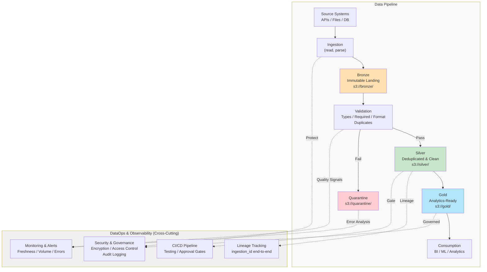
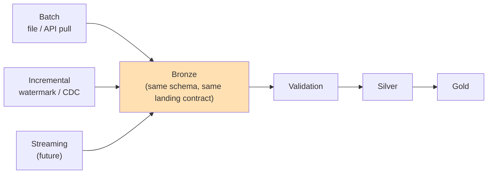

# Data Pipeline Architecture

## Overview

This document describes a production-ready data pipeline using a **Bronze → Silver → Gold** layered architecture. The design emphasizes simplicity, reliability, data quality, and observability.

---

## Assumptions

- **Batch Processing:** Daily (24-hour) batch cycles; sufficient for BI and analytical use cases
- **Data Format:** CSV, JSON, or structured file inputs
- **Scale:** Millions of events per day
- **Storage:** Cloud object storage (S3, GCS, or equivalent) available
- **Consumers:** BI tools, analytics queries, ML pipelines
- **Reliability Priority:** Data accuracy and auditability prioritized over ultra-low latency
- **Team:** Assumes dedicated data engineering capability; self-service analytics in future state

---

## Architecture Diagram



---

## Ingestion Strategy

The pipeline is designed so the **ingestion mechanism is pluggable while the downstream contract stays fixed**. Regardless of how data arrives, every source lands in Bronze in the same shape and flows through the same Validation → Silver → Gold stages. This is what makes the pattern reusable across data products rather than a one-off script per source.

| Mode | When to use | How it lands in Bronze |
|------|-------------|-------------------------|
| **Batch** (implemented in this take-home) | Daily/hourly extracts, file drops, low-freshness SLAs | Full or partitioned file read (CSV/JSON/Parquet) written as-is, tagged with `ingestion_timestamp` |
| **Incremental (watermark / CDC)** | Source supports `updated_at` or a CDC log, freshness in minutes-to-hours | Pull only rows past the last successful high-watermark, or apply a CDC stream (insert/update/delete) as append-only change events |
| **Streaming (future evolution)** | Sub-minute freshness required by a specific consumer | A Kafka/Kinesis consumer micro-batches events into the same Bronze layout on a short interval |



**Key point:** batch, incremental, and streaming ingestion differ only in *how Bronze gets populated*. Validation, Silver standardization/deduplication, and Gold modeling are ingestion-agnostic — they operate on "whatever landed in Bronze since the last run" regardless of source. Swapping a batch source for a CDC or streaming source requires a new ingestion adapter, not a redesign of the downstream pipeline.

For this take-home, batch ingestion is implemented (`src/reader.py` reads one CSV/JSON file per run). Incremental and streaming are described here as the natural evolution path, not implemented.

---

## Layer Design Decisions

### Bronze Layer (Raw Landing)

**Purpose:** Immutable, authoritative source for replay and audit.

**Design:**
- Exact copy-as-is from source (file readable check only, no business validation)
- Append-only; never updated or deleted
- Tagged with ingestion metadata: `ingestion_timestamp`, `source_system`, `ingestion_id`
- Enables full replayability: downstream failures don't affect raw data

**Storage:** Parquet (compressed), partitioned by `ingestion_date`

**Security Note:** Raw PII may exist in Bronze to preserve full replayability and auditability. Access is strictly restricted using least-privilege IAM roles; analysts access masked/tokenized data in Silver/Gold.

**Why:** Immutability enables safe recovery, auditability, and decouples ingestion from validation. Validation happens *after* data lands in Bronze.

---

### Silver Layer (Cleaned & Deduplicated)

**Purpose:** Business-ready, single source of truth for analytics.

**Design:**

**Deduplication:**
- Business key: `{customer_id, source_system, event_id}` identifies unique event
- When duplicates exist, keep record with highest `event_timestamp` (latest event time)
- If tied, keep highest `ingestion_timestamp` (most recent arrival)
- Window: 72 hours (covers late-arriving duplicates; older records assumed resolved)

**Standardization:**
- Timestamps: UTC ISO 8601
- Null handling: consistent representation
- Type coercion: strict (reject invalid amounts, dates, etc.)
- PII: tokenized (customer names, emails → hash) — see *Extension Points* below; the sample dataset has no name/email fields, so this take-home ships the hook, not the tokenization logic

**Storage:** Parquet, partitioned by `ingestion_date`; clustered/sorted on frequently filtered columns (e.g., source_system, customer_id) to optimize query performance without high-cardinality partitioning.

**Why:** Silver is the canonical form. Deduplication uses business logic; PII masking prevents accidental exposure. Schema versioning allows safe evolution.

---

### Gold Layer (Curated Analytics)

**Purpose:** Publish business-oriented, consumption-ready data products — not a single generic "clean" table.

**Design — dataset types:**
- **Fact tables** (`fact_events`): denormalized event grain with customer attributes, partitioned by `event_date`
- **Dimension tables** (`dim_customers`): Type 2 SCD (effective_date, end_date) for historical tracking; enables "as-of" joins
- **Aggregated datasets** (`agg_daily_revenue`): pre-computed rollups by date/customer for fast dashboards
- **ML feature datasets**: point-in-time-correct feature tables (e.g., rolling customer spend, event frequency) built from the same Silver source, versioned so training and serving use consistent definitions

**Intended consumers:**

| Consumer | Access pattern |
|----------|----------------|
| BI dashboards | Aggregated datasets, via warehouse/lakehouse SQL |
| SQL analysts | Fact/dimension tables, ad-hoc joins |
| Machine learning | Feature datasets, batch or online feature-store export |
| Data products / other teams | Fact/dimension tables treated as a stable, owned contract |
| APIs | Aggregated or feature datasets served through a thin read API, not direct table access |

**Why:** Modeling Gold as distinct fact/dimension/aggregate/feature datasets — instead of one wide table — lets each consumer use the shape suited to their access pattern, and lets datasets evolve independently as long as each keeps its own contract stable.

---

## Schema Evolution

Source schemas change over time (new fields, renamed fields, type widening). The pipeline handles this by keeping each layer's contract explicit and by preferring additive, backward-compatible changes:

- **Additive columns:** new source fields land in Bronze automatically (schema-on-read) and are ignored by Silver/Gold until a validated transformation is added for them. Existing consumers are unaffected.
- **Backward-compatible changes only, by default:** column removals or type narrowing require a new schema version and a migration plan (dual-write or a deprecation window), not an in-place change to a production table.
- **Versioned schemas:** `src/models.py` defines the curated and quarantine schemas as explicit contracts (`CURATED_SCHEMA`, `QUARANTINE_SCHEMA`). In production these would be versioned (e.g., `events_v2`) so downstream jobs can pin to a known schema and migrate on their own timeline instead of breaking on deploy.
- **Why Apache Iceberg would be preferred in production:** Iceberg (or Delta Lake) gives schema evolution as a first-class table operation — add/rename/reorder columns without rewriting files, safe concurrent schema and data changes, and time travel to audit what a table looked like before a schema change. That removes the need to hand-roll versioning and backfills.
- **Why this take-home intentionally uses Parquet instead:** at this scale (a handful of files, single-process pandas job, no concurrent writers), a table format adds operational and dependency overhead without a corresponding benefit. Plain partitioned Parquet keeps the exercise simple and dependency-light while preserving the same columnar, compressed storage. The migration path to Iceberg is additive — existing Parquet files can be registered into an Iceberg table without rewriting data.

---

## Data Quality & Validation

**Validation (Implementation Focus):**

Core validation rules applied in Silver layer to catch data quality issues before analytics consumption:

| Field | Rule | Action |
|-------|------|--------|
| `event_id` | NOT NULL, format valid | Quarantine |
| `customer_id` | NOT NULL | Quarantine |
| `event_timestamp` | Valid ISO 8601, not future | Quarantine |
| `amount` | Numeric, >= 0 | Quarantine |
| Uniqueness | No duplicate `{customer_id, event_id}` within 72h | Deduplicate |

**Quarantine Handling:**
- Records failing validation land in `s3://quarantine/` with error details
- Enables diagnosis without blocking pipeline
- Data steward inspects and reprocesses after fixing upstream issue

**Data Quality Monitoring (Production Enhancement):**

The following signals can be tracked in production (not required for this implementation):
- Freshness: time since latest record ingested
- Completeness: percentage of non-null values per column
- Volume trends: row count anomalies
- Duplicate rate: indicator of upstream issues
- Validation failure rate: quality degradation over time

---

## Late-Arriving Data & Reprocessing

Late-arriving records (events that reach the pipeline after their `event_date` has already been processed) are handled without corrupting already-published Gold datasets:

- **Watermark processing:** each run tracks the maximum `ingestion_timestamp` it has processed. The next run reads everything at or after that watermark, so a record that arrives late is picked up on the next scheduled run rather than silently missed.
- **Replay from Bronze:** because Bronze is immutable and append-only, any run can be safely replayed by re-reading the affected Bronze partition(s) — Bronze is the durable source of truth, so reprocessing never depends on Silver/Gold still holding the original data.
- **Partition reprocessing:** Silver/Gold are partitioned by date, so a late record only requires reprocessing the partition(s) it affects (e.g., re-running one day) rather than a full-table rebuild.
- **Idempotent reruns:** deduplication runs on the business key (`customer_id`, `source_system`, `event_id`) on every run, not just on first arrival. Re-running the same day, or reprocessing a day that now includes a late-arriving duplicate, converges to the same curated output rather than accumulating duplicates.
- **Incorporating late data safely:** a late record is merged into its correct partition (upsert / replace-partition semantics) rather than appended to "today's" run, so historical Gold aggregates stay correct for the date the event actually belongs to.

**Scope note:** the take-home implementation demonstrates this pattern at small scale — the dedup logic and idempotent full-file overwrite show the mechanics — but it does not implement true partition-level watermark tracking or partial reprocessing. A production version would track watermarks explicitly (e.g., a small state table) and reprocess only the affected date partitions instead of the whole dataset on every run.

---

## Orchestration & Execution

**Pipeline Stages (Daily Batch):**

```
Trigger: Daily

├── fetch_and_ingest (read APIs/files/DBs, write Bronze)
├── validate_quality (check types, required fields, duplicates)
│   ├── Pass → transform_to_silver (deduplicate, standardize, mask PII)
│   └── Fail → quarantine
├── aggregate_to_gold (build fact, dimension, aggregate tables)
└── publish_metrics (log quality signals, freshness, volume)
```

**Orchestration Platform:** Platform-agnostic design. Can be implemented using Apache Airflow, AWS Step Functions, Prefect, or equivalent. Loose coupling between stages enables easy substitution.

**Idempotency:**
- Each run tagged with execution date
- Re-running same day produces identical output (no duplicates)
- Enables safe replay of failed runs

**Error Handling:**
- Transient failures (network, timeout): retry with backoff
- Validation failures: route to Quarantine; continue pipeline
- Critical pipeline failures: alert; halt further promotion

---

## Security & Data Governance

**Data Classification:**
- **Public:** Customer IDs, transaction amounts
- **Internal:** Customer names, emails (tokenized in Silver)
- **Sensitive:** Passwords, payment cards (never stored)

**Security Measures:**
- Encryption in transit: TLS for all API/S3 calls
- Encryption at rest: S3 default encryption (AES-256)
- Access control: IAM roles (least privilege); Bronze/Silver read-only for analysts
- Audit: S3 access logging; immutable records enable trail

**PII Handling:**
- At Bronze: store as-is (for replay/diagnosis)
- At Silver: tokenize (hash) customer names/emails — see *Extension Points* below for what's implemented vs. designed
- Governance: prevent accidental export of unmasked data

---

## Extension Points (Take-Home Scope vs. Production)

Three transformation steps are intentionally implemented as **hooks that run but do no work yet**, rather than left out entirely: `mask_pii()`, `standardize_currency()`, and `apply_business_transformations()` in `src/transformer.py`. Each is called by the pipeline, logs its intent, and returns the DataFrame unchanged. This keeps the pipeline's shape production-representative (validate → transform → mask → standardize → publish) without building logic the sample dataset doesn't exercise — it has no name/email fields, and all sample amounts are already in their listed currency.

What an enterprise implementation would plug into these hooks:
- **PII masking:** a tokenization/vaulting service (e.g., format-preserving encryption or a hash with a centrally managed salt) so the mapping between raw and masked values is centrally governed and revocable, not a local hash.
- **Currency normalization:** a reference-data feed (FX rates by date) joined in rather than a hard-coded rate, so historical amounts convert using the rate in effect at `event_timestamp`.
- **Business transformations:** a rules engine or versioned business-logic module, so domain rules can change without redeploying the pipeline and can be tested and audited independently.

This is a scope decision, not an oversight: the hooks exist so the extension points are visible in both the code and this document, while the actual integrations are out of scope for a 2–3 hour exercise.

---

## Cost Optimization

**Storage Efficiency:**
- Parquet + compression: ~80% reduction vs. CSV
- Partitioning by date: enables partition pruning
- Lifecycle policies: Quarantine (30 days) → Bronze (6 months) → archive beyond

**Compute Efficiency:**
- Daily batch: simpler, cheaper than streaming (sufficient for most BI use cases)
- Parallel ingestion by source_system
- Right-sized compute: balance cost vs runtime

**Why:** Storage is cheap; compute is expensive. Compression + partitioning provide 80/20 return on effort.

---

## CI/CD & Deployment

**Promotion Pipeline:**

```
Trigger: Pull Request → Merge Approval

Stage 1: Lint & Type Check (flake8, mypy, bandit)
Stage 2: Unit Tests (reader, validator, transformer, writer)
  └── Coverage: >= 80%
Stage 3: Integration Test (sample data → full pipeline)
Stage 4: Data Quality Test (validate against baseline)
Stage 5: Manual Code Review & Approval
Stage 6: Deploy to Staging (smoke tests)
Stage 7: Deploy to Production (gradual rollout)
```

**Environment Promotion:**

The same, unmodified pipeline artifact is promoted through environments — nothing is rebuilt or hand-edited between stages:

```
Developer (local run, unit tests)
    ↓
Dev (CI: lint, unit tests, data quality checks — every commit)
    ↓
Test (staging: full pipeline against representative sample data)
    ↓
Manual Approval (human reviewer gates production promotion)
    ↓
Production (monitored, prod data)
```

`.gitlab-ci.yml` implements a condensed version of this flow for the take-home's scope: `lint` / `unit_tests` / `data_quality` / `build` stand in for the Developer + Dev stages, `deploy_staging` stands in for Test, `manual_prod_gate` is the approval gate, and `deploy_prod` is the final promotion — each later stage runs only if every prior stage succeeded (`needs:`).

**Configuration is environment-driven, not code-driven:** the same code and container image run in every environment; only environment variables change (e.g., input/output paths, credentials, feature flags), injected via GitLab CI/CD variables scoped per `environment:` rather than via branches or code edits. This is what makes promotion safe — the artifact that passed tests in Dev/Test is bit-for-bit the artifact that runs in Production.

**Environment Management:**
- Dev: local + CI; full test suite
- Staging: pre-prod; sample data; all controls
- Production: prod data; monitoring + alerting

**Rollback:** Reprocess from Bronze if Silver/Gold corrupted.

---

## Trade-offs & Justification

| Decision | Rationale |
|----------|-----------|
| **Batch vs. Streaming** | Batch (daily) sufficient for BI/analytics. Add streaming only if sub-minute freshness required. |
| **Schema-on-Read (Bronze) vs. Schema-on-Write (Silver/Gold)** | Flexible upstream captures all source data; strict downstream prevents bad data from analytics. |
| **Deduplication Window (72 hours)** | Covers late-arriving duplicates; balances memory/compute vs. accuracy. |
| **Immutable Bronze** | Enables replay, audit, recovery. Storage overhead minimal. |
| **Airflow Orchestration** | Logs every step; enables debugging, transparency. Alternative: managed Step Functions (lighter ops, less visibility). |
| **Parquet (take-home) vs. Iceberg (production)** | Plain Parquet keeps the exercise dependency-light; Iceberg adds native schema evolution, time travel, and safe concurrent writes at production scale — see *Schema Evolution*. |

---

## Observability & Alerting

**Key Signals:**

| Signal | Purpose |
|--------|---------|
| Pipeline Duration | Detect performance regression |
| Ingestion Freshness | Data recency |
| Row Count Trend | Detect upstream issues or corruption |
| Validation Failure Rate | Quality degradation |
| Duplicate Rate | High indicates upstream duplicate source |

**Stack:** Logs (CloudWatch/ELK), Metrics (Prometheus/Grafana), Lineage (tracking via ingestion_id), Alerts (PagerDuty for critical SLA breaches)

---

## Production Roadmap (Future)

1. **Streaming:** Kafka → Bronze for real-time events
2. **Schema Registry:** formalize the versioned-schema approach described in *Schema Evolution* as enforced producer contracts
3. **Advanced Quality:** ML-based anomaly detection
4. **dbt Integration:** Version control, testing, documentation for transformations
5. **Multi-region Replication:** Critical datasets to secondary region for DR
6. **Lineage Platform:** DataHub / OpenMetadata for column-level lineage

---

## Summary

This architecture delivers:

✅ **Reliability:** Immutable Bronze, quarantine for failures, idempotent execution  
✅ **Observability:** Quality metrics, lineage tracking, operational alerting  
✅ **Security:** Encryption, access control, PII handling, audit trails  
✅ **Maintainability:** Clear separation of concerns, versioned schemas, modular code  
✅ **Cost-Efficiency:** Compression, partitioning, lifecycle policies, batch processing  

Production-ready and intentionally simple while remaining extensible. As data volume and platform requirements evolve, the design scales naturally through incremental additions (streaming, advanced quality, multi-region replication, etc.).
