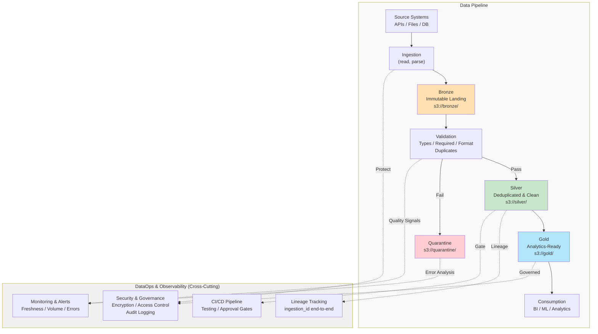

# Data Pipeline Architecture

## Overview

This document describes a production-ready data pipeline using a **Bronze → Silver → Gold** layered architecture. The design emphasizes simplicity, reliability, data quality, and observability.

---

## Assumptions

- **Batch Processing:** Daily (24-hour) batch cycles; sufficient for BI and analytical use cases
- **Data Format:** CSV, JSON, or structured file inputs
- **Scale:** Millions of events per day
- **Storage:** Cloud object storage (S3, GCS, or equivalent) available
- **Consumers:** BI tools, analytics queries, ML pipelines
- **Reliability Priority:** Data accuracy and auditability prioritized over ultra-low latency
- **Team:** Assumes dedicated data engineering capability; self-service analytics in future state

---

## Architecture Diagram



---

## Layer Design Decisions

### Bronze Layer (Raw Landing)

**Purpose:** Immutable, authoritative source for replay and audit.

**Design:**
- Exact copy-as-is from source (file readable check only, no business validation)
- Append-only; never updated or deleted
- Tagged with ingestion metadata: `ingestion_timestamp`, `source_system`, `ingestion_id`
- Enables full replayability: downstream failures don't affect raw data

**Storage:** Parquet (compressed), partitioned by `ingestion_date`

**Security Note:** Raw PII may exist in Bronze to preserve full replayability and auditability. Access is strictly restricted using least-privilege IAM roles; analysts access masked/tokenized data in Silver/Gold.

**Why:** Immutability enables safe recovery, auditability, and decouples ingestion from validation. Validation happens *after* data lands in Bronze.

---

### Silver Layer (Cleaned & Deduplicated)

**Purpose:** Business-ready, single source of truth for analytics.

**Design:**

**Deduplication:**
- Business key: `{customer_id, source_system, event_id}` identifies unique event
- When duplicates exist, keep record with highest `event_timestamp` (latest event time)
- If tied, keep highest `ingestion_timestamp` (most recent arrival)
- Window: 72 hours (covers late-arriving duplicates; older records assumed resolved)

**Standardization:**
- Timestamps: UTC ISO 8601
- Null handling: consistent representation
- Type coercion: strict (reject invalid amounts, dates, etc.)
- PII: tokenized (customer names, emails → hash)

**Storage:** Parquet, partitioned by `ingestion_date`; clustered/sorted on frequently filtered columns (e.g., source_system, customer_id) to optimize query performance without high-cardinality partitioning.

**Why:** Silver is the canonical form. Deduplication uses business logic; PII masking prevents accidental exposure. Schema versioning allows safe evolution.

---

### Gold Layer (Curated Analytics)

**Purpose:** Optimized for downstream consumption (BI, ML, dashboards).

**Design:**
- **fact_events:** Denormalized event table with customer attributes, partitioned by `event_date`
- **dim_customers:** Type 2 SCD (effective_date, end_date) for historical tracking; enables "as-of" joins
- **agg_daily_revenue:** Pre-computed aggregates by date/customer; enables fast dashboards

**Why:** Minimal denormalization + pre-aggregates improve query performance for BI tools. Type 2 SCD supports historical reporting.

---

## Data Quality & Validation

**Validation (Implementation Focus):**

Core validation rules applied in Silver layer to catch data quality issues before analytics consumption:

| Field | Rule | Action |
|-------|------|--------|
| `event_id` | NOT NULL, format valid | Quarantine |
| `customer_id` | NOT NULL | Quarantine |
| `event_timestamp` | Valid ISO 8601, not future | Quarantine |
| `amount` | Numeric, >= 0 | Quarantine |
| Uniqueness | No duplicate `{customer_id, event_id}` within 72h | Deduplicate |

**Quarantine Handling:**
- Records failing validation land in `s3://quarantine/` with error details
- Enables diagnosis without blocking pipeline
- Data steward inspects and reprocesses after fixing upstream issue

**Data Quality Monitoring (Production Enhancement):**

The following signals can be tracked in production (not required for this implementation):
- Freshness: time since latest record ingested
- Completeness: percentage of non-null values per column
- Volume trends: row count anomalies
- Duplicate rate: indicator of upstream issues
- Validation failure rate: quality degradation over time

---

## Orchestration & Execution

**Pipeline Stages (Daily Batch):**

```
Trigger: Daily

├── fetch_and_ingest (read APIs/files/DBs, write Bronze)
├── validate_quality (check types, required fields, duplicates)
│   ├── Pass → transform_to_silver (deduplicate, standardize, mask PII)
│   └── Fail → quarantine
├── aggregate_to_gold (build fact, dimension, aggregate tables)
└── publish_metrics (log quality signals, freshness, volume)
```

**Orchestration Platform:** Platform-agnostic design. Can be implemented using Apache Airflow, AWS Step Functions, Prefect, or equivalent. Loose coupling between stages enables easy substitution.

**Idempotency:**
- Each run tagged with execution date
- Re-running same day produces identical output (no duplicates)
- Enables safe replay of failed runs

**Error Handling:**
- Transient failures (network, timeout): retry with backoff
- Validation failures: route to Quarantine; continue pipeline
- Critical pipeline failures: alert; halt further promotion

---

## Security & Data Governance

**Data Classification:**
- **Public:** Customer IDs, transaction amounts
- **Internal:** Customer names, emails (tokenized in Silver)
- **Sensitive:** Passwords, payment cards (never stored)

**Security Measures:**
- Encryption in transit: TLS for all API/S3 calls
- Encryption at rest: S3 default encryption (AES-256)
- Access control: IAM roles (least privilege); Bronze/Silver read-only for analysts
- Audit: S3 access logging; immutable records enable trail

**PII Handling:**
- At Bronze: store as-is (for replay/diagnosis)
- At Silver: tokenize (hash) customer names/emails
- Governance: prevent accidental export of unmasked data

---

## Cost Optimization

**Storage Efficiency:**
- Parquet + compression: ~80% reduction vs. CSV
- Partitioning by date: enables partition pruning
- Lifecycle policies: Quarantine (30 days) → Bronze (6 months) → archive beyond

**Compute Efficiency:**
- Daily batch: simpler, cheaper than streaming (sufficient for most BI use cases)
- Parallel ingestion by source_system
- Right-sized compute: balance cost vs runtime

**Why:** Storage is cheap; compute is expensive. Compression + partitioning provide 80/20 return on effort.

---

## CI/CD & Deployment

**Promotion Pipeline:**

```
Trigger: Pull Request → Merge Approval

Stage 1: Lint & Type Check (flake8, mypy, bandit)
Stage 2: Unit Tests (reader, validator, transformer, writer)
  └── Coverage: >= 80%
Stage 3: Integration Test (sample data → full pipeline)
Stage 4: Data Quality Test (validate against baseline)
Stage 5: Manual Code Review & Approval
Stage 6: Deploy to Staging (smoke tests)
Stage 7: Deploy to Production (gradual rollout)
```

**Environment Management:**
- Dev: local + CI; full test suite
- Staging: pre-prod; sample data; all controls
- Production: prod data; monitoring + alerting

**Rollback:** Reprocess from Bronze if Silver/Gold corrupted.

---

## Trade-offs & Justification

| Decision | Rationale |
|----------|-----------|
| **Batch vs. Streaming** | Batch (daily) sufficient for BI/analytics. Add streaming only if sub-minute freshness required. |
| **Schema-on-Read (Bronze) vs. Schema-on-Write (Silver/Gold)** | Flexible upstream captures all source data; strict downstream prevents bad data from analytics. |
| **Deduplication Window (72 hours)** | Covers late-arriving duplicates; balances memory/compute vs. accuracy. |
| **Immutable Bronze** | Enables replay, audit, recovery. Storage overhead minimal. |
| **Airflow Orchestration** | Logs every step; enables debugging, transparency. Alternative: managed Step Functions (lighter ops, less visibility). |

---

## Observability & Alerting

**Key Signals:**

| Signal | Purpose |
|--------|---------|
| Pipeline Duration | Detect performance regression |
| Ingestion Freshness | Data recency |
| Row Count Trend | Detect upstream issues or corruption |
| Validation Failure Rate | Quality degradation |
| Duplicate Rate | High indicates upstream duplicate source |

**Stack:** Logs (CloudWatch/ELK), Metrics (Prometheus/Grafana), Lineage (tracking via ingestion_id), Alerts (PagerDuty for critical SLA breaches)

---

## Production Roadmap (Future)

1. **Streaming:** Kafka → Bronze for real-time events
2. **Schema Registry:** Producer contracts to prevent breaking changes
3. **Advanced Quality:** ML-based anomaly detection
4. **dbt Integration:** Version control, testing, documentation for transformations
5. **Multi-region Replication:** Critical datasets to secondary region for DR
6. **Lineage Platform:** DataHub / OpenMetadata for column-level lineage

---

## Summary

This architecture delivers:

✅ **Reliability:** Immutable Bronze, quarantine for failures, idempotent execution  
✅ **Observability:** Quality metrics, lineage tracking, operational alerting  
✅ **Security:** Encryption, access control, PII handling, audit trails  
✅ **Maintainability:** Clear separation of concerns, versioned schemas, modular code  
✅ **Cost-Efficiency:** Compression, partitioning, lifecycle policies, batch processing  

Production-ready and intentionally simple while remaining extensible. As data volume and platform requirements evolve, the design scales naturally through incremental additions (streaming, advanced quality, multi-region replication, etc.).
